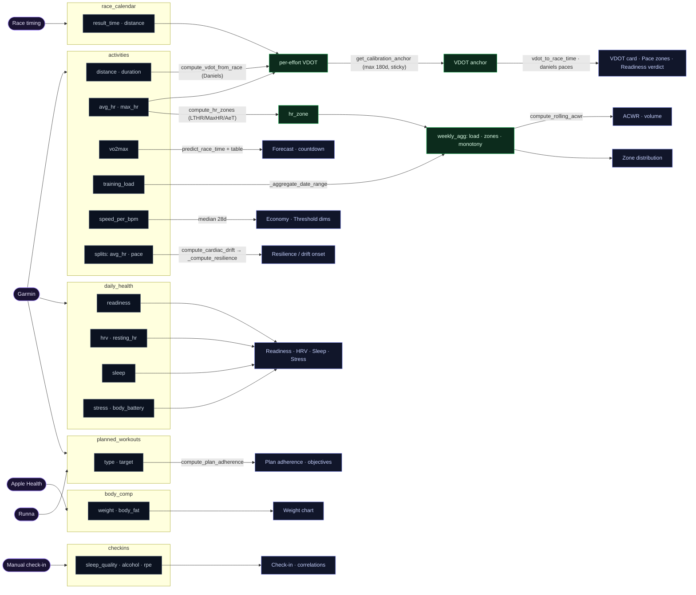
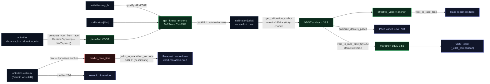
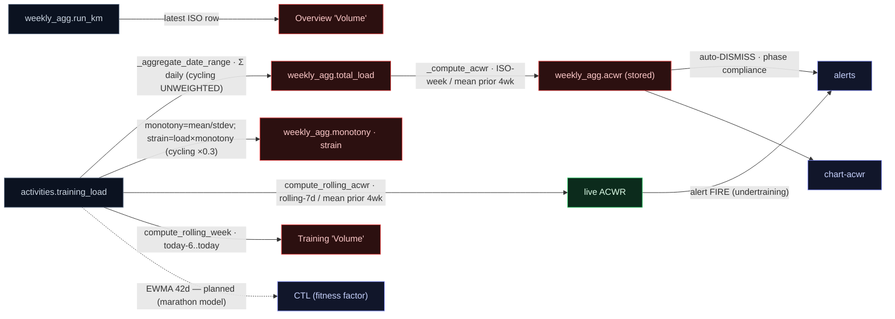
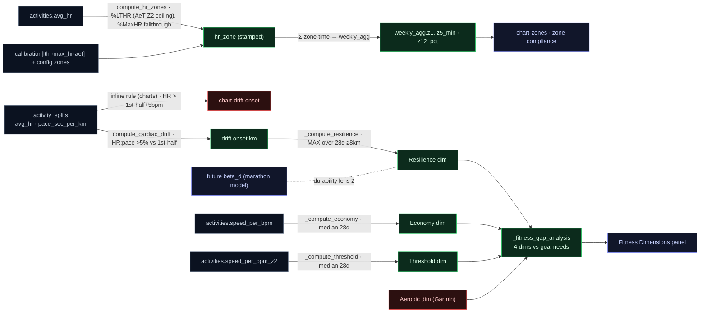
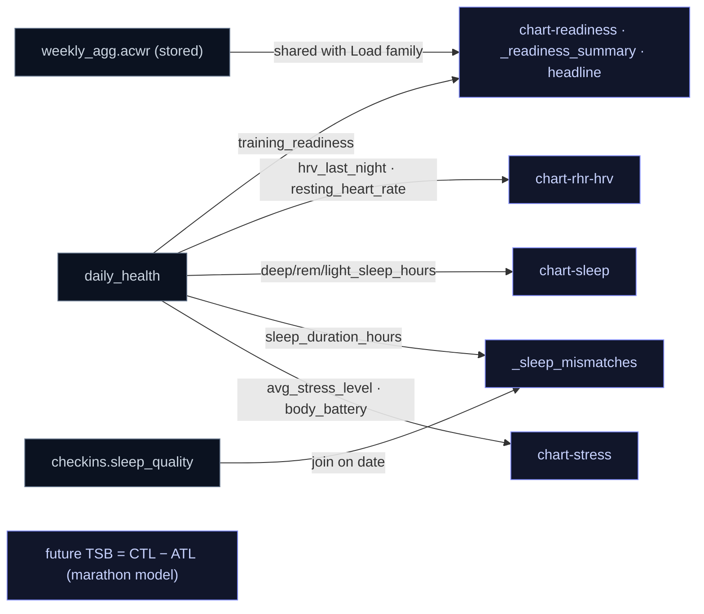
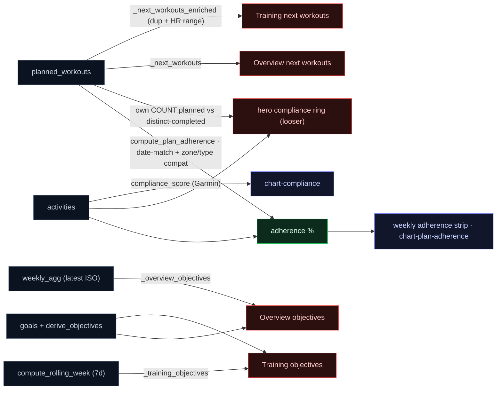

# Data lineage — dashboard quantities → functions → sources

**Purpose.** For every quantity on the dashboard, trace it back through the
function(s) that compute it to the raw sources (DB tables/columns, calibrations,
config), so we can see *which source feeds which metric* and — the point of this
doc — *where two metrics compute the same concept by different routes* (the
duplicated / alternative logic that makes the dashboard tell inconsistent
stories). Generated by reading the code (`file:line` citations); keep it updated
when the computation layer changes.

**Layers.** `sources` (DB / calibration / config / external) → `primitives`
(`fit/fitness.py`, `fit/analysis.py`, `fit/calibration.py`, `fit/periodization.py`,
`fit/narratives.py`, `fit/plan.py`, `fit/goals.py`, `fit/alerts.py`,
`fit/correlations.py`) → `builders` (`fit/report/sections/*.py`) → `template`
(`fit/report/templates/dashboard.html`).

---

## 0. Lineage diagrams

### Holistic view — provider → source → transform → metric

Providers (left) → source **tables as boxes** with their **columns nested inside** → labelled **transform** edges → derived nodes → the dashboard metric. Principal flows (the per-family diagrams below carry the full detail).

### Per-family detail (with duplications)

Each concept family drawn in full, with competing/alternative paths flagged. Green = the canonical value to converge on; red = a competing/alternative path that can disagree (the §4 backlog); grey = source; blue = a displayed quantity.

### A. VDOT / prediction (D1·D2·D3)

### B. Load · ACWR · volume (D6·D7·D11)

### C. Durability · zones · dimensions (D4·D5)

### D. Recovery (Readiness tab)

### E. Plan / objectives (D7·D9·D14)

---

## 1. Sources

- **`activities`** — distance_km, duration_min, pace_sec_per_km, avg_hr, max_hr, avg_cadence, vo2max, aerobic_te, rpe, srpe, training_load, speed_per_bpm, speed_per_bpm_z2, hr_zone(_lthr/_maxhr), effort_class, run_type, type, compliance_score, temp_at_start_c, splits_status, lthr_used/max_hr_used.
- **`activity_splits`** — split_num, pace_sec_per_km, avg_hr, elevation_gain/loss_m.
- **`daily_health`** — training_readiness, hrv_last_night, resting_heart_rate, sleep_*_hours, avg_stress_level, body_battery_*.
- **`weekly_agg`** — run_km, run_count, longest_run_km, total_load, z1..z5_min, z12_pct, z45_pct, acwr, monotony, strain, consecutive_weeks_3plus.
- **`calibration`** — metric, value, method, confidence, date, flags (read only via `get_active_calibration` / `get_calibration_anchor`).
- **`race_calendar`**, **`training_phases`**, **`goals`**, **`planned_workouts`**, **`checkins`**, **`body_comp`**, **`weather`**, **`correlations`**.
- **config** — `profile.zones_*`, `zone_model`, `max_hr`, `analysis.cycling_load_weight`, `coaching.readiness_gate_threshold`.
- **external** — `reports/coaching.json` (coaching notes, written by the fit-coach skill).

---

## 2. Computation primitives (source → quantity)

| Quantity / concept | Function (`file:line`) | Reads | Transform |
|---|---|---|---|
| HR zones + effort class | `analysis.compute_hr_zones` (`analysis.py:17`) | config zones_*/zone_model/max_hr; args avg_hr,lthr,max_hr,aet | dual %MaxHR + %LTHR ladders; primary by zone_model fallthrough; AeT refines Z2 ceiling |
| speed_per_bpm (economy) | `analysis.compute_speed_per_bpm` (`analysis.py:181`) | distance,duration,avg_hr | (m/min)/avg_hr |
| speed_per_bpm_z2 (helper) | `analysis.compute_speed_per_bpm_z2` (`analysis.py:190`) | + z2_range default [115,134] | spb if avg_hr in Z2 — **but stored value is gated on active zone model in `enrich_activity`** |
| run-type | `analysis.classify_run_type` (`analysis.py:203`) | type,name,distance,hr_zone,weekly_km | keywords + long-run rule; never 'race' |
| enrich (orchestrator) | `analysis.enrich_activity` (`analysis.py:259`) | calls zones/spb/run-type | stamps zones, effort, spb, spb_z2 (=spb if hr_zone=='Z2'), lthr_used/max_hr_used |
| date-range aggregate (km, zone-time, monotony, strain, load) | `analysis._aggregate_date_range` (`analysis.py:317`) | activities, daily_health, body_comp; config cycling_load_weight | sums + monotony=mean/stdev daily load, strain=load×monotony |
| weekly agg (ISO) | `analysis.compute_weekly_agg` (`analysis.py:474`) | `_aggregate_date_range`+`_compute_acwr`+`_compute_streak` | ISO Mon–Sun |
| rolling 7-day agg | `analysis.compute_rolling_week` (`analysis.py:500`) | `_aggregate_date_range` | today-6→today |
| ACWR (rolling acute) | `analysis.compute_rolling_acwr` (`analysis.py:530`) | rolling-7d acute / 4 ISO-week chronic | live ACWR |
| ACWR (ISO acute) | `analysis._compute_acwr` (`analysis.py:840`) | ISO-week acute / 4 ISO-week chronic | **stored** in weekly_agg.acwr |
| Daniels VDOT from race | `fitness.compute_vdot_from_race` (`fitness.py:247`) | `_oxygen_cost`,`_vo2max_fraction` | VDOT = O2cost(v)/%VO2max(t) |
| VDOT → race time (inverse) | `fitness.vdot_to_race_time` (`fitness.py:285`) | `compute_vdot_from_race` | binary search |
| VDOT → marathon seconds (TABLE) | `analysis._vdot_to_marathon_seconds` (`analysis.py:637`) | `_VDOT_TABLE` | **interpolated table — deliberately pessimistic, disagrees with the inverse** |
| race-time prediction | `analysis.predict_race_time` (`analysis.py:659`) | Riegel `T·(D₂/D₁)^1.06` + `_vdot_to_marathon_seconds` | per-race Riegel + Daniels-table VDOT + band |
| aerobic dim | `fitness._compute_aerobic` (`fitness.py:83`) | activities.vo2max 28d; `_median`,`_compute_trend` | median Garmin VO2max |
| threshold dim | `fitness._compute_threshold` (`fitness.py:109`) | activities.speed_per_bpm_z2 28d | median Z2 spb |
| economy dim | `fitness._compute_economy` (`fitness.py:137`) | activities.speed_per_bpm 28d | median spb |
| resilience dim (durability) | `fitness._compute_resilience` (`fitness.py:165`) | activity_splits via `fit_file.compute_cardiac_drift` | MAX drift-onset over 28d long runs |
| cardiac drift (primitive) | `fit_file.compute_cardiac_drift` (`fit_file.py:220`) | splits avg_hr,pace | first 2nd-half split >5% over first-half HR:pace ratio |
| effective VDOT | `fitness._compute_effective_vdot` (`fitness.py:488`) | garmin_vo2, race_vdot | race VDOT ≤180d else garmin−5 |
| fitness profile (4 dims + effective_vdot) | `fitness.get_fitness_profile` (`fitness.py:17`) | the four dims + `get_calibration_anchor('vdot')` | **overrides effective_vdot with the VDOT anchor when present** |
| fitness anchors (effort filter) | `fitness.get_fitness_anchors` (`fitness.py:330`) | get_active_calibration(lthr); activities+splits+race_calendar; `compute_vdot_from_race` | 5–25km, HR≥LTHR, CV≤15% → per-effort VDOT |
| best recent race VDOT | `fitness._get_race_vdot` (`fitness.py:449`) | race_calendar ≤180d | max VDOT |
| Daniels paces E/M/T/I/R | `analysis.compute_daniels_paces` (`analysis.py:588`) | `fitness.vdot_to_race_time(vo2max,42.195)` | M from formula inverse, others as offsets |
| canonical calibration anchor | `calibration.get_calibration_anchor` (`calibration.py:301`) | AGGREGATION_POLICY; calibration; `_max_in_window`/`_median_in_window` | sticky confirmed + windowed max/median suggestion + stale |
| active calibration (asof) | `calibration.get_active_calibration` (`calibration.py:154`) | calibration; STALENESS_THRESHOLDS | non-stale→confidence→recency; point-in-time |
| sRPE | `analysis.compute_srpe` (`analysis.py:761`) | activities.rpe,duration | rpe×duration |
| training gap / RTR cap | `analysis.detect_training_gap` (`analysis.py:792`) | activities | ≥14d gap → 50% cap +12.5%/wk |
| phase status / readiness | `periodization.advance_phase_status` (`:159`) / `evaluate_phase_readiness` (`:193`) | training_phases, weekly_agg, race_calendar | by date; advance/extend/deload/taper |
| heat acclimatization | `periodization.compute_heat_acclimatization` (`:322`) | activities (spb,temp 56d) | hot-run efficiency Δ% |
| pacing strategy | `periodization.generate_pacing_strategy` (`:379`) | config max_hr; prediction_seconds | negative-split splits + HR ceilings |
| correlations | `correlations.compute_all_correlations` (`:36`) / `compute_rolling_correlations` (`:191`) | checkins, daily_health, activities | lagged Spearman, n≥15 \|r\|≥0.2 |
| plan adherence | `plan.compute_plan_adherence` (`:570`) | planned_workouts, activities | date-match, compliance %, override flags |
| readiness recommendation | `plan.get_readiness_recommendation` (`:846`) | planned_workouts, daily_health.training_readiness, activities | swap quality session if readiness<gate |
| phase compliance | `goals.get_phase_compliance` (`:211`) | training_phases, weekly_agg | recent-2-week avg vs phase targets |
| target race | `goals.get_target_race` (`:154`) | race_calendar⋈goals | linked→furthest→nearest |
| alerts | `alerts.run_alerts` (`:39`) | weekly_agg, daily_health, checkins; `detect_training_gap`,`compute_rolling_acwr` | threshold rules |
| trend badges / why-connectors / walk-break / z2-remediation / narratives | `narratives.*` | weekly_agg, activities, checkins, daily_health | 4wk-vs-4wk pills, efficiency links, Z2 remediation |

---

## 3. Dashboard quantities (quantity → builder → primitives/columns)

All builders take `conn`, live in `fit/report/sections/`. Charts in `charts.py:_all_charts`.

### Overview
| Quantity | Builder (`file:line`) | Calls / reads |
|---|---|---|
| Headline + signal | `_headline` (`cards.py:28`), `_headline_signal` (`:44`) | `headline.generate_headline`; daily_health, weekly_agg.acwr, training_phases |
| Prediction string | `_prediction_summary` (`predictions.py:10`) | `_vdot_to_marathon_seconds`; race_calendar; activities.vo2max |
| Race countdown card | `_race_countdown` (`cards.py:1311`) | `narratives.generate_race_countdown`, `predict_race_time`, `_vdot_to_marathon_seconds`; activities.vo2max |
| Prediction-trend chart data | `_prediction_trend_data` (`cards.py:1916`) | `_vdot_to_marathon_seconds`, `predict_race_time`, `derive_checkpoint_targets`; activities.vo2max |
| Attention panel | `_attention_items` (`cards.py:550`) | calibration status/anchor/suggestions, `get_fitness_anchors`; coaching.json |
| Overview objectives | `_overview_objectives` (`cards.py:1747`) | `derive_objectives`; **latest weekly_agg row** + 4-wk Z2 |
| Readiness summary | `_readiness_summary` (`cards.py:1820`) | daily_health, weekly_agg.acwr/monotony |
| Check-in / alerts / correlations / definitions / next-workouts / sleep-mismatches | `_checkin` (`:195`), `_recent_alerts` (`:1198`), `_correlation_bars` (`:1216`), `_definitions` (`:987`), `_next_workouts` (`:1707`), `_sleep_mismatches` (`:1268`) | as labelled |

### Profile
| Quantity | Builder (`file:line`) | Calls / reads |
|---|---|---|
| Physiology anchors (LTHR/MaxHR/AeT/VO2max) | `_physiology` (`cards.py:811`) | `get_active_calibration` |
| VDOT vs Garmin | `_vdot_comparison` (`cards.py:305`) | `get_calibration_anchor('vdot')`, `vdot_to_race_time`; activities.vo2max |
| Calibration history | `_calibration_history` (`cards.py:408`) | `get_active_calibration`; calibration.* |
| Pace zones | `_pace_zones` (`cards.py:917`) | `compute_daniels_paces`, `get_calibration_anchor('vdot')` |
| Race-readiness hero | `_race_readiness_hero` (`cards.py:2155`) | `get_fitness_profile().effective_vdot`, `vdot_to_race_time` |
| Today's capability | `_todays_capability` (`cards.py:2261`) | `get_fitness_profile` |
| Fitness dimensions (4) | `_fitness_gap_analysis` (`cards.py:2318`) | `get_fitness_profile`, `derive_objectives` |
| Body comp | `_body_comp_data` (`cards.py:2404`) | body_comp; goals.target_value |
| Profile takeaways | `_profile_takeaways` (`cards.py:2466`) | re-calls capability/gap/countdown/vdot/split/pace/body; `compute_rolling_week`; get_active_calibration |

### Training
| Quantity | Builder (`file:line`) | Calls / reads |
|---|---|---|
| Last-7-days hero (vol + compliance ring) | `_last_7_days_hero` (`cards.py:3579`) | `compute_rolling_week`, `_next_workouts_enriched`; **own COUNT-based compliance** |
| Training objectives | `_training_objectives` (`cards.py:3453`) | `get_target_race`, `compute_rolling_week`; goals |
| Per-run cards | `_last_7_days_runs` (`cards.py:2793`) | `compute_hr_zones`, `get_active_calibration`, `compute_cardiac_drift` |
| Weekly plan adherence | `_weekly_plan_adherence` (`cards.py:2740`) | `plan.compute_plan_adherence` |
| Phase compliance | `_phase_compliance` (`cards.py:1241`) | `goals.get_phase_compliance` |

### Readiness / Coach
| Quantity | Builder (`file:line`) | Calls / reads |
|---|---|---|
| Calibration panel / data-health | `_calibration_panel` (`cards.py:1254`), `_data_health_panel` (`:1261`) | `get_calibration_status`, `check_data_sources` |
| Coaching insights | `_coaching` (`cards.py:1024`) | coaching.json |

### Charts (`charts.py:_all_charts`)
`chart-volume` (Training, weekly_agg/activities) · `chart-readiness`/`chart-rhr-hrv`/`chart-sleep`/`chart-stress`/`chart-acwr` (Readiness, daily_health/weekly_agg) · `chart-weight`/`chart-efficiency`/`chart-vo2`/`chart-zones`/`chart-drift`/`chart-drift-trend`/`chart-pacecv`/`chart-effort-gap`/`chart-cadence`/`chart-marathon-pred`/`chart-cal-<metric>` (Profile) · `chart-plan-adherence`/`chart-compliance` (Training).

---

## 4. ⚠️ Duplicated / alternative logic — the reconciliation backlog

The same concept computed by different routes, producing values that can disagree. **Status** ties each to work in flight.

| # | Concept | Competing implementations (`file:line`) | How they differ | Status |
|---|---|---|---|---|
| D1 | **VDOT → marathon time** | `analysis._vdot_to_marathon_seconds` table (`analysis.py:637`) **vs** `fitness.vdot_to_race_time` formula (`fitness.py:285`) | Disagree (table deliberately pessimistic). Only `predict_race_time`/forecast use the table; paces/checkpoints/objectives use the formula → forecast & training paces quote different marathon-equivalents | **in flight** — `marathon-durability-model` replaces the forecast path |
| D2 | **"current VDOT / aerobic capacity"** | raw `activities.vo2max` (predictions, charts, trend-badges, countdown) · `get_calibration_anchor('vdot')` (paces, vdot card, MCP) · `effective_vdot` (readiness hero, capability, dims) · `_compute_aerobic` median Garmin · `get_fitness_anchors` (chart-vo2, attention) | up to 5 "engine" numbers; anchor is canonical but the prediction/chart/badge paths still read raw Garmin (optimistic) | **partially fixed** (anchor wired into paces/dims/MCP/effective_vdot); forecast+charts+badges still on raw Garmin → finish in `marathon-durability-model` |
| D3 | **marathon/race prediction** | `_prediction_summary` (`predictions.py:10`) · `_race_prediction` (`predictions.py:84`) · `_race_countdown` (`cards.py:1311`) · `_prediction_trend_data` (`cards.py:1916`) · `chart-marathon-pred` (`charts.py:893`) · `_race_readiness_hero` (`cards.py:2155`) | 6 builders; some Riegel+table range, one "conservative upper bound", one from effective_vdot — Overview prediction ≠ Profile readiness verdict; Riegel race-source (result_time vs COALESCE) inconsistent | **in flight** — model unifies the forecast (one source of truth per IA/integration spec) |
| D4 | **durability** | `_compute_resilience` MAX onset (`fitness.py:165`, via `compute_cardiac_drift`) · run-story inline onset (`periodization.py:92`) · `narratives.detect_walk_break_need` cross-run proxy (`:427`) · fixed Riegel exp 1.06 in `predict_race_time` · (future) model `beta_d` | 4–5 "how well you hold up" computations, no shared definition | **open** — design `marathon-durability-model` to present resilience + `beta_d` as two lenses; consolidate the drift definition |
| D5 | **cardiac-drift onset** | `compute_cardiac_drift` library (`fit_file.py:220`) **vs** inline chart rule (`charts.py:622,664`) | two independent onset algorithms on the same splits → different km for the same run | **open** (small) — route charts through the library primitive |
| D6 | **ACWR** | `compute_rolling_acwr` (live, `analysis.py:530`) **vs** `_compute_acwr` stored in weekly_agg (`:840`) | acute term differs (rolling-7d vs ISO-week); **alert fires on rolling but auto-dismisses on ISO** (`alerts.py:132` vs `:294`) | **open** — pick one acute definition; align fire/dismiss |
| D7 | **weekly volume / objectives** | `_overview_objectives` latest ISO `weekly_agg` (`cards.py:1747`) **vs** `_training_objectives` `compute_rolling_week` (`:3453`) | Overview "Volume" (ISO week) ≠ Training "Volume" (rolling 7d) for the same day; Z2 uses 4-wk-avg vs rolling | **open** — IA change should make Overview summarize the Training number |
| D8 | **Z2 / easy-% compliance** | 4-wk-avg (`_overview_objectives`) · rolling-week (`_training_objectives`, `_profile_takeaways._zones`) · per-ISO-week (`chart-zones`) | 4 windows for "easy %" | **open** |
| D9 | **plan adherence** | `compute_plan_adherence` (weekly strip, chart) **vs** hero compliance ring's own COUNT ratio (`cards.py:3645`) | hero ring % ≠ weekly-adherence % (looser definition) | **open** (small) |
| D10 | **weight target** | `goals WHERE type='metric' AND name LIKE '%eight%'` (status_cards, chart-weight) **vs** `goals WHERE metric='weight'` (`_weight_card_data`, `_body_comp_data`) | two query shapes for the same target; change-span computed twice (8-row vs 20-row window) | **open** (bug-risk) |
| D11 | **cycling load weighting** | `total_load` sums cycling **unweighted** (`analysis.py:388`) **vs** monotony/strain weight cycling by `cycling_load_weight` (`:405`) | strain and total_load apply different cycling weights | **open** (subtle) |
| D12 | **readiness gate** | `alerts.run_alerts` (`alerts.py:68`) **vs** `plan.get_readiness_recommendation` (`plan.py:846`) | same 40→50 gate implemented twice with different gap detection; auto-dismiss hardcodes 40 | **open** |
| D13 | **deload / build-streak** | `_count_consecutive_build_weeks` (`periodization.py:304`) · `_check_deload_overdue` (`alerts.py:148`) · `evaluate_phase_readiness` (`:238`) | 30%-drop rule re-implemented 3× with different window bounds | **open** |
| D14 | **next workouts** | `_next_workouts` (`cards.py:1707`) **vs** `_next_workouts_enriched` (`:3690`) | same query+regex duplicated; enriched adds HR range | **open** (minor) |
| D15 | **inverse_vdot** alias | `fitness.inverse_vdot` (`:313`) just calls `compute_vdot_from_race` | redundant name, no divergence | **open** (cosmetic) |

---

## 5. Dead / legacy context keys

Builders that **run on every report but whose output the template never references** (verified by grep; re-verify before deleting): `status_cards`, `status_cards_actions`, `run_timeline`, `journey`, `wow`, `race_prediction`, `milestones`, `goal_progress`, `plan_adherence` (the `_plan_adherence` one), `upcoming_races`, `trend_badges`, `why_connectors`, `walk_break`, `z2_remediation`, `volume_story`, `derived_objectives`. Each is wasted compute per render and a maintenance trap. Candidate for a cleanup pass.

---

*Generated 2026-06-03 by tracing the code. Update when the computation/builder layer changes.*
