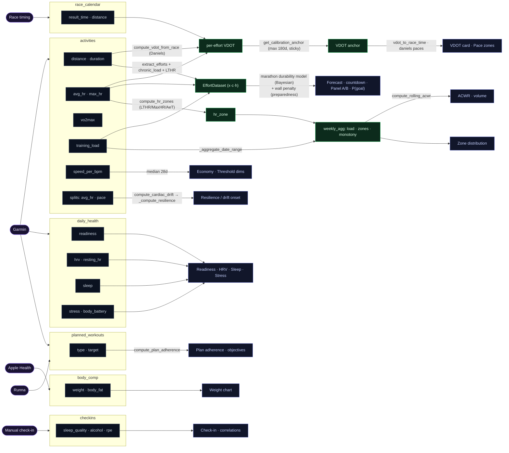
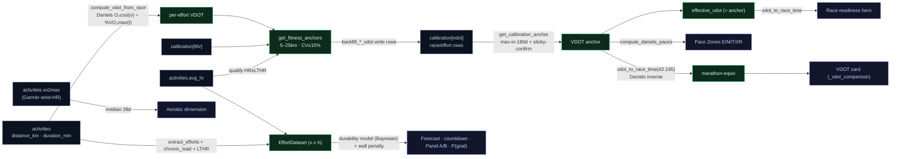
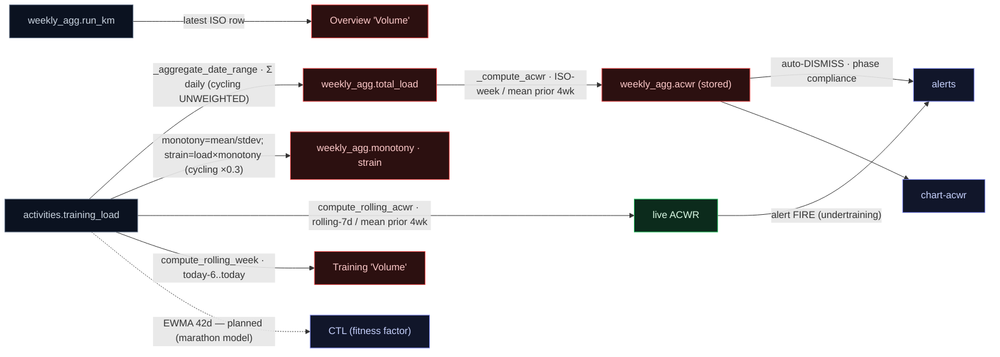
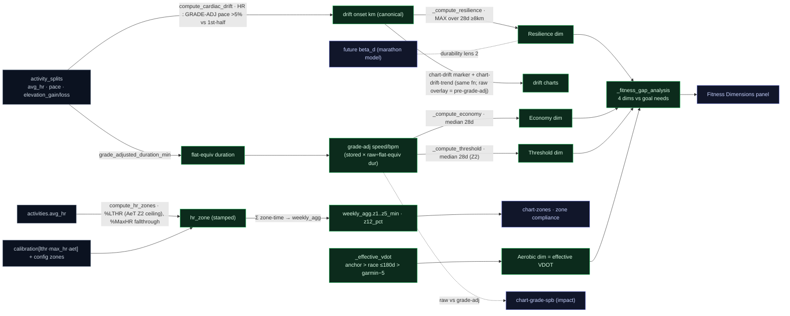
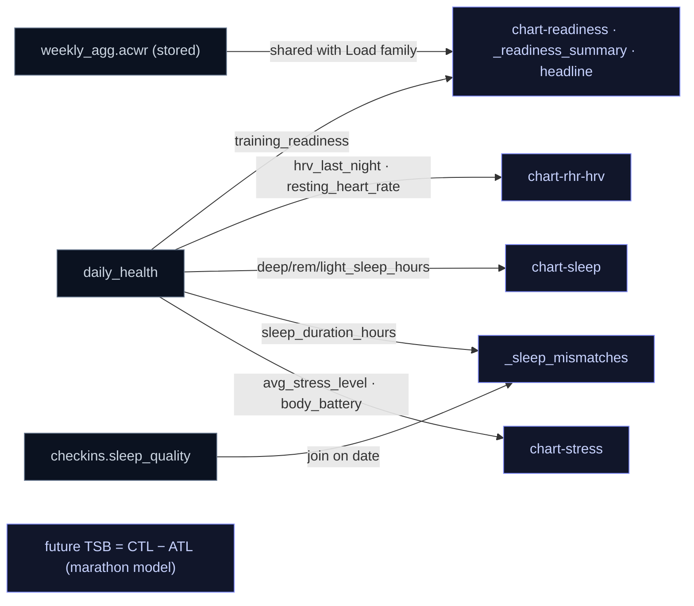
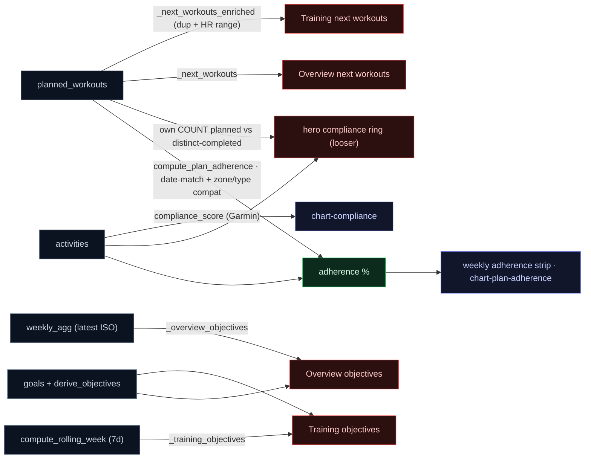

# Data lineage — dashboard quantities → functions → sources

**Purpose.** For every quantity on the dashboard, trace it back through the
function(s) that compute it to the raw sources (DB tables/columns, calibrations,
config), so we can see *which source feeds which metric* and — the point of this
doc — *where two metrics compute the same concept by different routes* (the
duplicated / alternative logic that makes the dashboard tell inconsistent
stories). Generated by reading the code (`file:line` citations); keep it updated
when the computation layer changes.

**Layers.** `sources` (DB / calibration / config / external) → `primitives`
(`fit/fitness.py`, `fit/analysis.py`, `fit/calibration.py`, `fit/periodization.py`,
`fit/narratives.py`, `fit/plan.py`, `fit/goals.py`, `fit/alerts.py`,
`fit/correlations.py`) → `builders` (`fit/report/sections/*.py`) → `template`
(`fit/report/templates/dashboard.html`).

---

## 0. Lineage diagrams

### Holistic view — provider → source → transform → metric

Providers (left) → source **tables as boxes** with their **columns nested inside** → labelled **transform** edges → derived nodes → the dashboard metric. Principal flows (the per-family diagrams below carry the full detail).



### Per-family detail (with duplications)

Each concept family drawn in full, with competing/alternative paths flagged. <span style="color:#22c55e">Green</span> = the canonical value to converge on; <span style="color:#ef4444">red</span> = a competing/alternative path that can disagree (the §4 backlog); grey = source; blue = a displayed quantity.

### A. VDOT / prediction (D1·D2·D3)



### B. Load · ACWR · volume (D6·D7·D11)



### C. Durability · zones · dimensions (D4·D5)



### D. Recovery (Readiness tab)



### E. Plan / objectives (D7·D9·D14)



---

## 1. Sources

- **`activities`** — distance_km, duration_min, pace_sec_per_km, avg_hr, max_hr, avg_cadence, vo2max, aerobic_te, rpe, srpe, training_load, speed_per_bpm, speed_per_bpm_z2, hr_zone(_lthr/_maxhr), effort_class, run_type, type, compliance_score, temp_at_start_c, splits_status, lthr_used/max_hr_used.
- **`activity_splits`** — split_num, pace_sec_per_km, avg_hr, elevation_gain/loss_m.
- **`daily_health`** — training_readiness, hrv_last_night, resting_heart_rate, sleep_*_hours, avg_stress_level, body_battery_*.
- **`weekly_agg`** — run_km, run_count, longest_run_km, total_load, z1..z5_min, z12_pct, z45_pct, acwr, monotony, strain, consecutive_weeks_3plus.
- **`calibration`** — metric, value, method, confidence, date, flags (read only via `get_active_calibration` / `get_calibration_anchor`).
- **`race_calendar`**, **`training_phases`**, **`goals`**, **`planned_workouts`**, **`checkins`**, **`body_comp`**, **`weather`**, **`correlations`**.
- **config** — `profile.zones_*`, `zone_model`, `max_hr`, `analysis.cycling_load_weight`, `coaching.readiness_gate_threshold`.
- **external** — `reports/coaching.json` (coaching notes, written by the fit-coach skill).

---

## 2. Computation primitives (source → quantity)

| Quantity / concept | Function (`file:line`) | Reads | Transform |
|---|---|---|---|
| HR zones + effort class | `analysis.compute_hr_zones` (`analysis.py:17`) | config zones_*/zone_model/max_hr; args avg_hr,lthr,max_hr,aet | dual %MaxHR + %LTHR ladders; primary by zone_model fallthrough; AeT refines Z2 ceiling |
| speed_per_bpm (economy) | `analysis.compute_speed_per_bpm` (`analysis.py:181`) | distance,duration,avg_hr | (m/min)/avg_hr |
| speed_per_bpm_z2 (helper) | `analysis.compute_speed_per_bpm_z2` (`analysis.py:190`) | + z2_range default [115,134] | spb if avg_hr in Z2 — **but stored value is gated on active zone model in `enrich_activity`** |
| run-type | `analysis.classify_run_type` (`analysis.py:203`) | type,name,distance,hr_zone,weekly_km | keywords + long-run rule; never 'race' |
| enrich (orchestrator) | `analysis.enrich_activity` (`analysis.py:259`) | calls zones/spb/run-type | stamps zones, effort, spb, spb_z2 (=spb if hr_zone=='Z2'), lthr_used/max_hr_used |
| date-range aggregate (km, zone-time, monotony, strain, load) | `analysis._aggregate_date_range` (`analysis.py:317`) | activities, daily_health, body_comp; config cycling_load_weight | sums + monotony=mean/stdev daily load, strain=load×monotony |
| weekly agg (ISO) | `analysis.compute_weekly_agg` (`analysis.py:474`) | `_aggregate_date_range`+`_compute_acwr`+`_compute_streak` | ISO Mon–Sun |
| rolling 7-day agg | `analysis.compute_rolling_week` (`analysis.py:500`) | `_aggregate_date_range` | today-6→today |
| ACWR (rolling acute) | `analysis.compute_rolling_acwr` (`analysis.py:530`) | rolling-7d acute / 4 ISO-week chronic | live ACWR |
| ACWR (ISO acute) | `analysis._compute_acwr` (`analysis.py:840`) | ISO-week acute / 4 ISO-week chronic | **stored** in weekly_agg.acwr |
| Daniels VDOT from race | `fitness.compute_vdot_from_race` (`fitness.py:247`) | `_oxygen_cost`,`_vo2max_fraction` | VDOT = O2cost(v)/%VO2max(t) |
| VDOT → race time (inverse) | `fitness.vdot_to_race_time` (`fitness.py:285`) | `compute_vdot_from_race` | binary search |
| ~~VDOT → marathon seconds (TABLE)~~ | — | — | **DELETED** (D1) — superseded by the durability model |
| marathon forecast | `fit.marathon.predict.forecast` + `durability_panel`/`trend_series`/`derived_metrics` | `model.fit` posterior · `preparedness.extrapolation_prior` · `chronic_load` · `maximal_effort_h` | median + 90% interval + P(goal); the single forecast source |
| chronic load (fitness state) | `fit.training_load.chronic_load[_before]` | daily `training_load` trailing-28d mean | shared with ACWR's chronic denominator |
| race-time prediction (Riegel) | `analysis.predict_race_time` (`analysis.py`) | Riegel `T·(D₂/D₁)^1.06`; vdot leg via the anchor | per-race extrapolation; the cold-start fallback only |
| **grade-adjusted pace / duration** | `fit_file.grade_adjusted_pace_sec` / `grade_adjusted_duration_min` | per-split elevation_gain/loss · distance | flat-equivalent (linearised Minetti: +12 s/km per +1% climb, −6 per 1% descent); strips terrain (Anstieg). Falls back to raw when no elevation |
| aerobic dim | `fitness._compute_aerobic` | **`_effective_vdot`** (NOT Garmin VO2max); Garmin only shapes the trend, shifted to the anchor level | = effective VDOT — the single trusted aerobic value |
| threshold dim | `fitness._compute_threshold` | **`_ga_spb_series('speed_per_bpm_z2')`** | median Z2 spb, **grade-adjusted** |
| economy dim | `fitness._compute_economy` | **`_ga_spb_series('speed_per_bpm')`** | median spb, **grade-adjusted** |
| resilience dim (durability) | `fitness._compute_resilience` | activity_splits via `compute_cardiac_drift` (grade-adj) | MAX drift-onset over 28d long runs |
| cardiac drift (primitive) | `fit_file.compute_cardiac_drift` | splits avg_hr · **grade-adjusted** pace · elevation | first 2nd-half split >5% over first-half HR:GAP ratio; CV gate on grade-adj pace. **THE single drift source** (was 5 forks) |
| **effective VDOT (single source)** | `fitness._effective_vdot` | `get_calibration_anchor('vdot')` > race VDOT ≤180d > garmin−5 | every aerobic consumer reads this — dim + headline never diverge |
| fitness profile (4 dims + effective_vdot) | `fitness.get_fitness_profile` | the four dims + `_effective_vdot` | aerobic dim and effective_vdot share one source |
| fitness anchors (effort filter) | `fitness.get_fitness_anchors` (`fitness.py:330`) | get_active_calibration(lthr); activities+splits+race_calendar; `compute_vdot_from_race` | 5–25km, HR≥LTHR, CV≤15% → per-effort VDOT |
| best recent race VDOT | `fitness._get_race_vdot` (`fitness.py:449`) | race_calendar ≤180d | max VDOT |
| Daniels paces E/M/T/I/R | `analysis.compute_daniels_paces` (`analysis.py:588`) | `fitness.vdot_to_race_time(vo2max,42.195)` | M from formula inverse, others as offsets |
| canonical calibration anchor | `calibration.get_calibration_anchor` (`calibration.py:301`) | AGGREGATION_POLICY; calibration; `_max_in_window`/`_median_in_window` | sticky confirmed + windowed max/median suggestion + stale |
| active calibration (asof) | `calibration.get_active_calibration` (`calibration.py:154`) | calibration; STALENESS_THRESHOLDS | non-stale→confidence→recency; point-in-time |
| sRPE | `analysis.compute_srpe` (`analysis.py:761`) | activities.rpe,duration | rpe×duration |
| training gap / RTR cap | `analysis.detect_training_gap` (`analysis.py:792`) | activities | ≥14d gap → 50% cap +12.5%/wk |
| phase status / readiness | `periodization.advance_phase_status` (`:159`) / `evaluate_phase_readiness` (`:193`) | training_phases, weekly_agg, race_calendar | by date; advance/extend/deload/taper |
| heat acclimatization | `periodization.compute_heat_acclimatization` (`:322`) | activities (spb,temp 56d) | hot-run efficiency Δ% |
| pacing strategy | `periodization.generate_pacing_strategy` (`:379`) | config max_hr; prediction_seconds | negative-split splits + HR ceilings |
| correlations | `correlations.compute_all_correlations` (`:36`) / `compute_rolling_correlations` (`:191`) | checkins, daily_health, activities | lagged Spearman, n≥15 \|r\|≥0.2 |
| plan adherence | `plan.compute_plan_adherence` (`:570`) | planned_workouts, activities | date-match, compliance %, override flags |
| readiness recommendation | `plan.get_readiness_recommendation` (`:846`) | planned_workouts, daily_health.training_readiness, activities | swap quality session if readiness<gate |
| phase compliance | `goals.get_phase_compliance` (`:211`) | training_phases, weekly_agg | recent-2-week avg vs phase targets |
| target race | `goals.get_target_race` (`:154`) | race_calendar⋈goals | linked→furthest→nearest |
| alerts | `alerts.run_alerts` (`:39`) | weekly_agg, daily_health, checkins; `detect_training_gap`,`compute_rolling_acwr` | threshold rules |
| trend badges / why-connectors / walk-break / z2-remediation / narratives | `narratives.*` | weekly_agg, activities, checkins, daily_health | 4wk-vs-4wk pills, efficiency links, Z2 remediation |

---

## 3. Dashboard quantities (quantity → builder → primitives/columns)

All builders take `conn`, live in `fit/report/sections/`. Charts in `charts.py:_all_charts`.

### Overview
| Quantity | Builder (`file:line`) | Calls / reads |
|---|---|---|
| Headline + signal | `_headline` (`cards.py:28`), `_headline_signal` (`:44`) | `headline.generate_headline`; daily_health, weekly_agg.acwr, training_phases |
| Marathon forecast block | `_marathon_forecast` (`predictions.py`) | durability model: `forecast`+`derived_metrics`+`influence`; degrades to `anchor_race_time` |
| Race countdown card | `_race_countdown` (`cards.py`) | hero Prediction = model median (`forecast`), anchor fallback; `narratives.generate_race_countdown` |
| Prediction-trend chart (Panel B) | `_prediction_trend_data` (`cards.py`) | `_model_week_trend` (model median+band per week); `derive_checkpoint_targets` |
| Attention panel | `_attention_items` (`cards.py:550`) | calibration status/anchor/suggestions, `get_fitness_anchors`; coaching.json |
| Overview objectives | `_overview_objectives` (`cards.py:1747`) | `derive_objectives`; **latest weekly_agg row** + 4-wk Z2 |
| Readiness summary | `_readiness_summary` (`cards.py:1820`) | daily_health, weekly_agg.acwr/monotony |
| Check-in / alerts / correlations / definitions / next-workouts / sleep-mismatches | `_checkin` (`:195`), `_recent_alerts` (`:1198`), `_correlation_bars` (`:1216`), `_definitions` (`:987`), `_next_workouts` (`:1707`), `_sleep_mismatches` (`:1268`) | as labelled |

### Profile
| Quantity | Builder (`file:line`) | Calls / reads |
|---|---|---|
| Physiology anchors (LTHR/MaxHR/AeT/VO2max) | `_physiology` (`cards.py:811`) | `get_active_calibration` |
| VDOT vs Garmin | `_vdot_comparison` (`cards.py:305`) | `get_calibration_anchor('vdot')`, `vdot_to_race_time`; activities.vo2max |
| Calibration history | `_calibration_history` (`cards.py:408`) | `get_active_calibration`; calibration.* |
| Pace zones | `_pace_zones` (`cards.py:917`) | `compute_daniels_paces`, `get_calibration_anchor('vdot')` |
| Race-readiness hero | `_race_readiness_hero` (`cards.py:2155`) | `get_fitness_profile().effective_vdot`, `vdot_to_race_time` |
| Today's capability | `_todays_capability` (`cards.py:2261`) | `get_fitness_profile` |
| Fitness dimensions (4) | `_fitness_gap_analysis` (`cards.py:2318`) | `get_fitness_profile`, `derive_objectives` |
| Body comp | `_body_comp_data` (`cards.py:2404`) | body_comp; goals.target_value |
| Profile takeaways | `_profile_takeaways` (`cards.py:2466`) | re-calls capability/gap/countdown/vdot/split/pace/body; `compute_rolling_week`; get_active_calibration |

### Training
| Quantity | Builder (`file:line`) | Calls / reads |
|---|---|---|
| Last-7-days hero (vol + compliance ring) | `_last_7_days_hero` (`cards.py:3579`) | `compute_rolling_week`, `_next_workouts_enriched`; **own COUNT-based compliance** |
| Training objectives | `_training_objectives` (`cards.py:3453`) | `get_target_race`, `compute_rolling_week`; goals |
| Per-run cards | `_last_7_days_runs` (`cards.py:2793`) | `compute_hr_zones`, `get_active_calibration`, `compute_cardiac_drift` |
| Weekly plan adherence | `_weekly_plan_adherence` (`cards.py:2740`) | `plan.compute_plan_adherence` |
| Phase compliance | `_phase_compliance` (`cards.py:1241`) | `goals.get_phase_compliance` |

### Readiness / Coach
| Quantity | Builder (`file:line`) | Calls / reads |
|---|---|---|
| Calibration panel / data-health | `_calibration_panel` (`cards.py:1254`), `_data_health_panel` (`:1261`) | `get_calibration_status`, `check_data_sources` |
| Coaching insights | `_coaching` (`cards.py:1024`) | coaching.json |

### Charts (`charts.py:_all_charts`)
`chart-volume` (Training, weekly_agg/activities) · `chart-readiness`/`chart-rhr-hrv`/`chart-sleep`/`chart-stress`/`chart-acwr` (Readiness, daily_health/weekly_agg) · `chart-weight`/`chart-efficiency`/`chart-vo2`/`chart-zones`/`chart-drift`/`chart-drift-trend`/`chart-pacecv`/`chart-effort-gap`/`chart-cadence`/`chart-marathon-pred`/`chart-cal-<metric>` (Profile) · `chart-plan-adherence`/`chart-compliance` (Training).

---

## 4. ⚠️ Duplicated / alternative logic — the reconciliation backlog

The same concept computed by different routes, producing values that can disagree. **Status** ties each to work in flight.

> **2026-06-07 SSOT pass.** Resolved **D2** (Aerobic dim → `_effective_vdot`, the single trusted aerobic source; Garmin VO2max is now reference-only), **D5** (cardiac-drift onset: five algorithms → one **grade-adjusted** `compute_cardiac_drift`), and the dashboard side of **D6** (ACWR card → `compute_rolling_acwr`). Added grade-adjustment (Anstieg) to drift, economy/threshold and the durability model's *time*; effort/HR (`effort_class`, model `h`) deliberately stays raw because HR already reflects real climb effort. New `chart-grade-spb` makes the raw-vs-adjusted difference auditable. **Justified deviations kept:** Riegel race-checkpoints on the Overview trend (`^1.06` ≈ measured β_d 1.07 — a labelled diagnostic) and `weekly_agg.acwr` as the ISO-week *trend* vs the rolling *card*. **D7–D14 reconciled (2026-06-07, second pass):** Overview volume/Z2 → rolling-7d (D7/D8); hero adherence → `compute_plan_adherence` (D9); one `_weight_target` helper, killing the broken `metric='weight'` query (D10); `total_load` weights cycling consistently (D11); the readiness gate + auto-dismiss route through `detect_training_gap` (D12); the 30%-drop build-streak is one helper (D13); `_next_workouts_base` shared (D14). Also **retired** the "VDOT anchors disagree with Garmin" attention item — that gap is the structural Garmin overestimate, not actionable (the Physiology tile shows Garmin as a labelled reference).

| # | Concept | Competing implementations (`file:line`) | How they differ | Status |
|---|---|---|---|---|
| D1 | **VDOT → marathon time** | ~~`_vdot_to_marathon_seconds` table vs `vdot_to_race_time` formula~~ | — | **RESOLVED** — the table + `_VDOT_TABLE` are **deleted**; the forecast is the durability model, training paces use the formula inverse |
| D2 | **"current VDOT / aerobic capacity"** | `_effective_vdot` (single helper: anchor > race ≤180d > garmin−5) read by paces, vdot card, MCP, readiness hero, capability, **and the Aerobic dim** · `get_fitness_anchors` (chart-vo2, attention) | — | **RESOLVED** (2026-06-07) — the Aerobic dim was the last holdout on raw Garmin VO2max; it now reads `_effective_vdot` like everything else (102% vs 38, not 114% vs 43). Garmin VO2max is reference-only (`chart-vo2` trend + a caveat). The forecast is the durability model |
| D3 | **marathon/race prediction** | `_marathon_forecast`, `_race_countdown`, `_race_readiness_hero`, `_prediction_trend_data`, `chart-marathon-pred`, `chart-durability`, MCP `_ctx_forecast` | — | **RESOLVED** — all read the one durability-model forecast (median+interval+P); Overview hero/block/trend + Profile hero/Panel A/Panel B agree (verified 4:03). Degrade to the anchor, never the table |
| D4 | **durability** | `_compute_resilience` drift-onset (HR:pace) · long-run **pace-fade** (speed) · model `beta_d` | — | **ADDRESSED** — glossary states the two siblings (Resilience = HR-decoupling, Pace-fade = speed give-back); dashboard leads with the measured signals, `beta_d` as the optimistic bound. Drift-definition consolidation (D5) still open |
| D5 | **cardiac-drift onset** | ~~`compute_cardiac_drift` vs inline chart rule vs `_compute_drift_onset` vs periodization ×1.05~~ (was FIVE algorithms) | — | **RESOLVED** (2026-06-07) — all routes go through `compute_cardiac_drift`, now **grade-adjusted** (HR : flat-equivalent pace). Resilience dim = Distance Ceiling = chart-drift marker = trend, all one source. chart-drift-trend overlays a "raw (no grade-adj)" series for transparency |
| D6 | **ACWR** | `compute_rolling_acwr` (live) **vs** `_compute_acwr` stored in weekly_agg | acute term differs (rolling-7d vs ISO-week) | **mostly fixed** (2026-06-07) — the dashboard ACWR **card** now uses `compute_rolling_acwr` (matches coaching/CLI). `weekly_agg.acwr` remains the ISO-week **trend** series (a distinct, labelled view). Alert fire-vs-dismiss alignment (`alerts.py:132`/`:294`) still open |
| D7 | **weekly volume / objectives** | one rolling-7d source | — | **RESOLVED** (2026-06-07) — `_overview_objectives` reads `compute_rolling_week` for volume/long-run/Z2 (matches the Training tab); only the streak stays ISO-week (CLAUDE.md) |
| D8 | **Z2 / easy-% compliance** | rolling-7d on the dashboard; `chart-zones` per-ISO-week (historical) | — | **RESOLVED** (2026-06-07) — Overview Z2 joined `_training_objectives`/`_profile_takeaways` on `compute_rolling_week`; `chart-zones` stays per-ISO-week by design. **Justified deviation:** MCP `_ctx_training` keeps a 4-wk coaching *trend* (labelled, deliberately debugged) |
| D9 | **plan adherence** | one `compute_plan_adherence` | — | **RESOLVED** (2026-06-07) — the hero compliance ring now calls `compute_plan_adherence` (current week, rest-excluded, distance/zone match), same as the weekly strip; the bespoke COUNT ratio is gone |
| D10 | **weight target** | one `_weight_target(conn)` helper | — | **RESOLVED** (2026-06-07) — single canonical query (`type='metric' AND name LIKE '%eight%'`); the broken `metric='weight'` queries (silent NULL — `goals` has no `metric` column) deleted |
| D11 | **cycling load weighting** | `cycling_load_weight` applied consistently | — | **RESOLVED** (2026-06-07) — `total_load` now weights cycling by `cycling_load_weight` like monotony/strain, so strain = total_load × monotony is no longer a weighted/unweighted mix |
| D12 | **readiness gate** | one `detect_training_gap` | — | **RESOLVED** (2026-06-07) — `get_readiness_recommendation` + the alert auto-dismiss both route through `detect_training_gap`; auto-dismiss is now gap-aware (was hardcoded 40 → stale alert) |
| D13 | **deload / build-streak** | one `_count_consecutive_build_weeks` | — | **RESOLVED** (2026-06-07) — `_check_deload_overdue` routes to the periodization helper (the 30%-drop rule); phase-local 4 / global 6 window bounds kept as intentional |
| D14 | **next workouts** | one `_next_workouts_base` loader | — | **RESOLVED** (2026-06-07) — `_next_workouts` + `_next_workouts_enriched` share `_next_workouts_base` (query + name-cleaning); enriched only adds zone/HR |
| D15 | **inverse_vdot** alias | `fitness.inverse_vdot` (`:313`) just calls `compute_vdot_from_race` | redundant name, no divergence | **open** (cosmetic) |
| D16 | **time window** (rolling-7d vs ISO-week) | see §4.1 below | the recurring "which 7 days?" question behind D6–D9 | **policy stated** (2026-06-10) — rolling-7d for fitness-state; ISO-week for plan-cadence + history; monotony/strain converge still open |

### 4.1 Window policy — rolling-7d vs ISO-week

Both windows run through one aggregation core (`_aggregate_date_range`); only the
boundary differs (`compute_rolling_week` = today-6→today; `compute_weekly_agg` =
Mon→Sun, persisted in `weekly_agg`). **The rule:**

- **Fitness-state "how am I right now" → rolling-7d.** A rolling window never lies on a
  Tuesday the way a 2-day-old ISO week does. Volume, zone %, ACWR acute already follow
  this (D6/D7/D8).
- **Plan-cadence → ISO-week.** Training plans are *authored per calendar week* ("this
  week: Mon easy, Wed tempo…"), so plan adherence is intrinsically a week question, not
  a rolling one (D9). Keeping it ISO-week is deliberate, **not** an inconsistency.
- **History / trend / streaks → ISO-week.** The `weekly_agg` store, the weekly bar
  charts, and `consecutive_weeks_3plus` are weekly by nature — rolling them would be
  wrong, not just different.

| surface | window | source |
|---|---|---|
| volume (km / runs) — "now" | rolling-7d | `compute_rolling_week` |
| zone compliance (Z1+Z2 %) — "now" | rolling-7d | `compute_rolling_week` |
| ACWR acute — "now" | rolling-7d | `compute_rolling_acwr` (chronic = prior 4 ISO wk) |
| plan adherence / compliance ring | **ISO-week** | `compute_plan_adherence` (plan cadence) |
| monotony / strain (read by alerts) | **ISO-week** | `weekly_agg` ← `compute_weekly_agg` |
| streak (`consecutive_weeks_3plus`) | ISO-week | `_compute_streak` |
| historical series (volume/zone/ACWR charts) | ISO-week | `weekly_agg` |

**Honest-labelling corollary:** a surface that shows an ISO-week figure must not sit
under a rolling-7d frame unqualified. The Overview hero card pairs a `LAST 7 DAYS`
rolling volume with a current-ISO-week compliance ring, so the ring is labelled
"% plan **this week**" (not relabelling it would imply rolling-7d).

**Still open (not an inconsistency the policy forbids, just not yet converged):**
monotony/strain are only ever computed as ISO-week (`weekly_agg`) yet are read on the
*live* alert path — candidate to add a rolling-7d form for "now" reads while keeping
the ISO-week copy as the trend. And **chronic load** has two formulas for one concept
(prior-4-ISO-weeks for the ACWR denominator vs the 28-day rolling
`training_load.chronic_load`) — the separate `TODO(load-unification)`.

---

## 5. Dead / legacy context keys

Builders that **run on every report but whose output the template never references** (verified by grep; re-verify before deleting): `status_cards`, `status_cards_actions`, `run_timeline`, `journey`, `wow`, `race_prediction`, `milestones`, `goal_progress`, `plan_adherence` (the `_plan_adherence` one), `upcoming_races`, `trend_badges`, `why_connectors`, `walk_break`, `z2_remediation`, `volume_story`, `derived_objectives`. Each is wasted compute per render and a maintenance trap. Candidate for a cleanup pass.

---

## 6. Glossary — ubiquitous language (DDD review)

The shared vocabulary. Code, dashboard copy, and docs use these terms with exactly
these meanings; a name that contradicts the glossary is a bug.

- **VDOT** — race-derived performance index (Daniels formula on actual race times).
  *Earned on the clock.* Calibration metric `vdot`. NEVER interchangeable with VO2max.
- **Garmin VO2max** — the wrist device's estimate (`activities.vo2max`). *Guessed by
  the wrist*; runs well above race-implied VDOT for this athlete. Reference-only —
  never an anchor, never a forecast input.
- **Calibration anchor** — the single canonical value per physiological metric
  (`get_calibration_anchor`). Trust precedence: **human confirm > device measurement >
  policy estimate (what races imply) > legacy**.
- **Method trust taxonomy** (calibration rows): `CONFIRMED` (`manual`, `confirmed` —
  human-owned, sticky) · `DEVICE` (`device_lt` — instrument measurement, authoritative
  below human) · `REFERENCE` (`device_vo2max` — context only, never an estimator input)
  · `INFORMATIONAL` (`race_observation`, `effort_observation` — history/chart rows) ·
  auto-derived candidates (`race_candidate`, `activity_max`, `drift_test`, `scale`).
  *(Renamed in migration 016 — formerly `garmin_lt`, `garmin_estimate`,
  `race_estimate`/`effort_estimate`, `race_extract`.)*
- **Chronic load** — THE fitness-state primitive: trailing mean of daily
  `training_load` (`fit.training_load.chronic_load`). ACWR's chronic denominator and
  the forecast's fitness covariate both resolve to this one concept (one load model,
  not two).
- **ACWR** — acute(rolling 7d) ÷ chronic load: the *injury-risk ratio*. Not a fitness
  trend — that's the chronic level itself.
- **Resilience** — aerobic-decoupling onset: the km where HR:pace decouples >5% within
  a run (cardiac/thermal signal). NOT the same as…
- **Pace-fade** — speed give-back over a long run's second half at ≥ Moderate effort
  (glycogen/neuromuscular signal; the evidence-backed marathon-durability marker).
- **Effort (qualifying)** — a continuous intensity-bearing run: a race, or
  tempo/progression at Hard/Very-Hard effort. Intervals are excluded (their distance
  includes recoveries). Maximality is carried by HR (`h`), never assumed from the label.
- **Marathon forecast** — the single race-day headline: `fit/marathon/` Bayesian model
  → median + 90% interval + P(goal). Sourced from `predict.forecast` everywhere (Overview
  hero/block/trend, Profile hero/Panel A/Panel B, `fit forecast` CLI, MCP coaching
  context). The old `_vdot_to_marathon_seconds` VDOT→time table is **deleted** (D1).
  Maximal-effort HR is LTHR-relative + **duration-keyed** (`effort_schedule` → `effort_h_for_distance`:
  offset(t)=β·(log t − log T₀) on the model's predicted DURATION, not distance). **T₀** is
  data-driven (prior + recency/representativeness-weighted at-threshold races); **β stays the
  population −6.5 prior** — race HRs can't fit the slope reliably (sub-maximal short parkruns), a
  Decision-4 follow-on gated on a maximality flag. β_d = durability exponent; φ = fitness value; κ = HR↔pace.
  Degrades to the calibrated-VDOT anchor (`anchor_race_time`) when the model isn't fit.
- **β_d (durability exponent)** — the fitted Riegel power-law slope. The *optimistic*
  cross-distance bound ("what holds if the power law extends"); the dashboard leads with
  the measured Resilience/Pace-fade signals when they disagree.
- **Extrapolation penalty (γ)** — the honesty overlay widening the forecast past your
  longest effort `d_max`: `γ ~ HalfStudentT(ν=4, extrapolation_scale)`,
  `extrapolation_scale = GENERIC_WALL_SCALE · shrink`. Driven by long-run distance +
  Pace-fade (NOT cardiac drift). *(Drafted as `s_drift`; renamed — drift doesn't drive
  it.)*
- **EffortDataset** — the model's input value object (`fit.marathon.features`): the
  efforts frame + `d_max`, `lthr`, `goal`. Explicit contract, not DataFrame `.attrs`.

### Bounded contexts (module → context)
```
Integration/ACL      garmin · apple_health · weather
Ingestion            sync
Physio Calibration   calibration                      (the model context for the rest)
Training Load        training_load   (queued from analysis: weekly_agg · monotony · sRPE)
Performance/Forecast fitness (Daniels) · marathon/ · prediction
Planning             goals · plan · periodization · milestones
Self-report          checkin
Insight/Narrative    correlations · alerts · narratives · coach-MCP
Presentation         report/
```
`analysis.py` is split along these seams incrementally (re-export shims left behind);
new load code lands in `training_load`.
